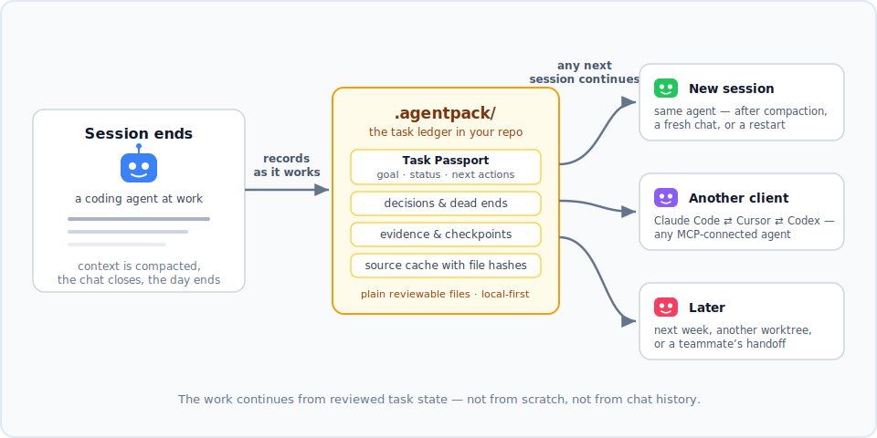

# Agentpack

[](https://www.npmjs.com/package/agentpack-cli)
[](https://github.com/ihorponom/agentpack/actions/workflows/ci.yml)
[](https://www.npmjs.com/package/agentpack-cli)
[](LICENSE)
[](https://glama.ai/mcp/servers/ihorponom/agentpack)

Repo-native task continuity for AI coding agents.

> Coding agents forget. Agentpack gives them the task state they need to continue.



Here it is live. Session 1: Claude Code investigates a flaky test and records what it learns through the Agentpack MCP tools. Session 2, next day, empty context: the agent loads the task state and picks up exactly where the first session stopped — no re-investigation:


Prefer to poke at it by hand? The same flow driven from the CLI is in [docs/DEMOS.md](docs/DEMOS.md).

Every session ends the same way: the context window gets compacted, the chat closes, the task waits until tomorrow. The next session starts from zero — re-reading files, rediscovering decisions, retrying approaches that already failed.

Agentpack keeps a small, reviewable task ledger in `.agentpack/` inside your repo. Connected agents record durable state as they work — the goal, decisions, dead ends, verification evidence, checkpoints — and the next session loads it back and continues. That next session can be the same agent after compaction, a different client, or you returning next week.

- **Local-first.** Plain files in your repo. No cloud, no telemetry, no network calls.
- **Agent-oriented.** A local MCP server plus generated project instructions (`AGENTS.md`, `CLAUDE.md`, Cursor rules) tell agents when to load and record state.
- **Human-friendly.** The same state is available through the CLI for inspection, debugging, and manual handoff.

## Quick start

Requires Node.js >= 20.

```bash
npm install -g agentpack-cli

cd path/to/your/repo
agentpack init                     # once per repo
agentpack install claude --write   # per client: codex | claude | cursor | claude-desktop
```

Restart or reconnect the coding-agent client. From then on the agent loads Agentpack context at session start, records durable decisions, sources, and evidence while working, and checkpoints meaningful progress.

Run `agentpack doctor` to verify the setup, and `agentpack resume --preset agent --query "<topic>"` to inspect the task state yourself.

See [docs/INTEGRATIONS.md](docs/INTEGRATIONS.md) for client-by-client setup, including what each installer writes and why.

## How it works

1. At session start, the agent loads compact Agentpack context: the current Task Passport, recent checkpoints, decisions, and reviewed source conclusions.
2. While working, it records durable state — decisions worth keeping, approaches that failed, verification evidence — and caches reviewed source conclusions with file hashes so unchanged files don't need re-reading.
3. At a coherent boundary, it creates a checkpoint with status, next actions, and git state.
4. The next session — any MCP-connected agent — continues from that state instead of rebuilding it from chat history.

The ledger is task-scoped: a **Task Passport** carries the goal, status, constraints, write scope, next actions, and verification for the current task, with an explicit lifecycle (start, park, switch, finalize) for handoffs. An optional **task gate** (native Claude Code, Codex, and Cursor hooks plus a client-neutral pre-commit hook) warns — or in block mode, stops — when edits bypass the active task.

Context is budgeted: resume output is compressed under a rough token estimate, so agents get the useful state back, not a pile of history.

## When it helps

- The context window is compacted mid-task and the next turn needs the state back.
- You start a fresh chat or session on an ongoing task.
- You switch between Claude Code, Cursor, Codex, or another MCP client.
- You return to a refactor or bugfix days later.
- Another agent — or a teammate's agent — continues from your checkpoint.
- You split one session across parts of a monorepo (`api/`, `frontend/`, `cron/`) with short scoped tasks, and the task gate keeps the agent from drifting outside the folder the current task owns.

A side effect: agents spend fewer tokens re-reading unchanged files and re-explaining old decisions.

## Security posture

- Zero runtime dependencies, exact dev dependencies, committed lockfile, `ignore-scripts=true`.
- No telemetry and no network calls during normal CLI or MCP operation.
- Best-effort redaction of secret-looking values in stored context and handoff output.
- Releases are published from GitHub Actions with [npm provenance](https://docs.npmjs.com/generating-provenance-statements) (Trusted Publisher, no long-lived tokens); verify with `npm audit signatures`.

See [SECURITY.md](SECURITY.md) for the full policy.

## Documentation

- [docs/INTEGRATIONS.md](docs/INTEGRATIONS.md) — safe setup for Codex, Claude Code, Cursor, Claude Desktop, and git hooks
- [docs/CLI.md](docs/CLI.md) — full CLI reference, budgets, and manual fallback workflows
- [docs/MCP.md](docs/MCP.md) — the MCP server contract and tool list
- [docs/TASK-PASSPORT.md](docs/TASK-PASSPORT.md) — task lifecycle, handoffs, and portable bundles
- [docs/DEMOS.md](docs/DEMOS.md) — compact continuity demos you can run yourself
- [docs/VISION.md](docs/VISION.md) — the strategic north star

## Contributing / local development

Clone the repo and use Node 20+:

```bash
npm ci --ignore-scripts
npm test
npm run mcp:smoke
node dist/src/agentpack.js --help
```

This repo uses Agentpack on itself through MCP — [docs/DOGFOOD.md](docs/DOGFOOD.md) describes the working protocol, [docs/SETUP.md](docs/SETUP.md) the full setup, and [docs/RELEASING.md](docs/RELEASING.md) the release process.

---

Mirror: [Codeberg](https://codeberg.org/ihorponom/agentpack). Issues, releases, and npm provenance stay on GitHub.
