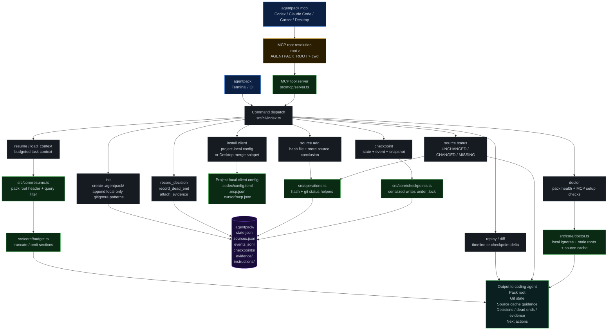

# Agentpack Execution Flow

## Notes

- Normal CLI commands find the nearest `.agentpack/` root upward from the current working directory after `agentpack init`.
- MCP clients can also pass an explicit root. Agentpack resolves MCP roots as `--root`, then `AGENTPACK_ROOT`, then `cwd`.
- Codex, Claude Code, and Cursor use project-local config. Claude Desktop needs a merge snippet because its config is global.
- `.agentpack/` is local-only by default and should not be committed in v0.
